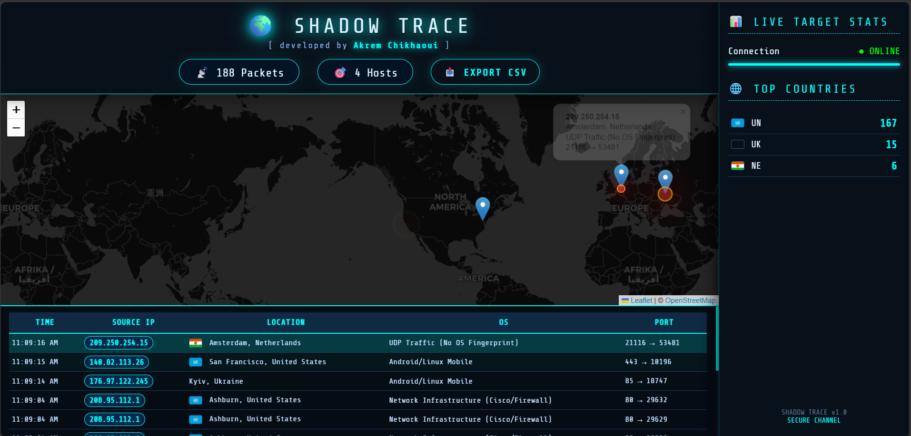
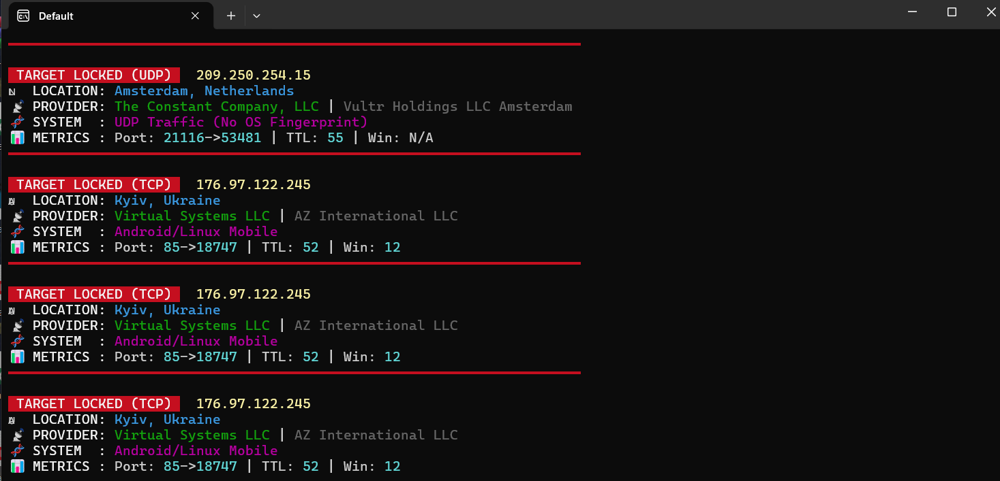

# 🌍 ShadowTrace v1.0
**Passive OSINT & Real-Time Network Traffic Visualizer**

ShadowTrace is an advanced cybersecurity project that captures live network traffic and transforms raw packets into a powerful real-time dashboard. It combines passive packet analysis, OS fingerprinting, and geolocation intelligence to provide clear visual insights into network activity.

---

## 📸 Dashboard Preview

### 🔹 Live Dashboard

*Interactive world map with traffic analytics and global connection tracking.*

### 🔹 Backend Engine

*Real-time packet processing engine running in terminal mode.*

---

## ✨ Key Features

- 📡 **Live Packet Sniffing** - Capture TCP / UDP traffic in real time.
- 🌍 **Interactive Cyber Map** - Visualize incoming connections globally using Leaflet.js.
- 💻 **OS Fingerprinting** - Estimate probable operating systems (Windows, Linux, macOS) using TTL & TCP Window Size.
- 📍 **Geo-Location Intelligence** - Retrieve Country, City, ISP, and flag for detected IP addresses.
- 📊 **Live Analytics** - Monitor traffic volume, sources, and trends instantly.
- 📁 **CSV Export** - Export captured session data for later analysis.
- ⚡ **WebSocket Communication** - Real-time synchronization between Python backend and frontend dashboard.

---

## 🛠️ Tech Stack

### Backend
- Python, Scapy, WebSockets, Rich Terminal UI

### Frontend
- HTML5, CSS3 (Cyberpunk Theme), JavaScript, Leaflet.js

---

## 🚀 Installation & Usage

### 1️⃣ Requirements
- Python 3.x
- Windows users must install **Npcap** for packet capture support: [https://npcap.com/](https://npcap.com/)

### 2️⃣ Setup
Clone the repository and install dependencies:

```bash
git clone https://github.com/akrem-dev-ops/ShadowTrace.git
cd ShadowTrace
pip install -r requirements.txt

```

3️⃣ Run
Launch the engine with administrative privileges:

```bash
python shadowtrace_server.py

```

The dashboard will open automatically in your browser.

👤 Developer
Akrem Chikhaoui

Disclaimer: This tool is created for educational and ethical security research only.
